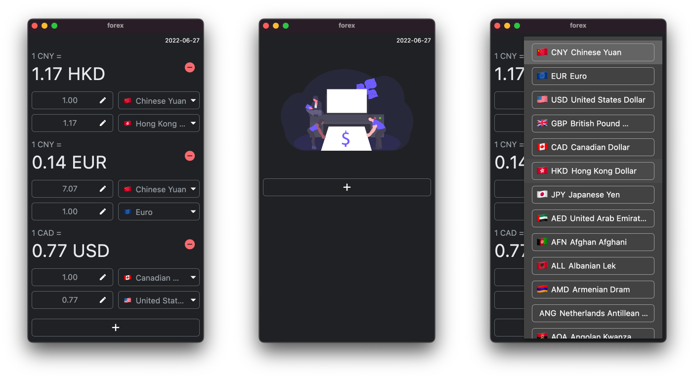

# forex

使用 Flutter 开发的货币汇率转换 App

编译环境：Flutter (Channel stable, 3.0.2, on macOS 12.4 21F79 darwin-x64, locale en-HK)，Xcode 13.4.1

## Getting Started

### [Bloc (Cubit) 状态管理](https://bloclibrary.dev)

### [pre-commit](https://pre-commit.com)

git hook，每次提交代码前格式化代码，检查代码问题。

[Flutter pre-commit: git 钩子](https://anicon.notion.site/Flutter-pre-commit-git-45356877e3f343c19c5e82c80e6e4d0f)

## 数据来源

### api

 [fixer.io](https://fixer.io)

> Foreign exchange rates and currency conversion JSON API

### 占位图

[unDraw](https://undraw.co/illustrations)